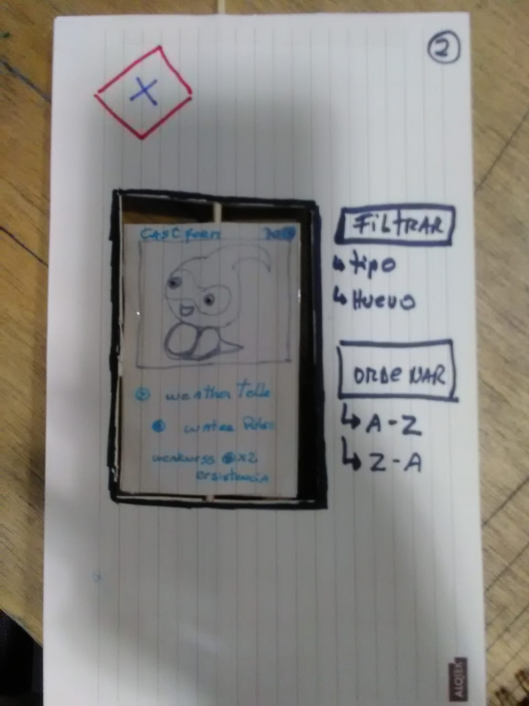
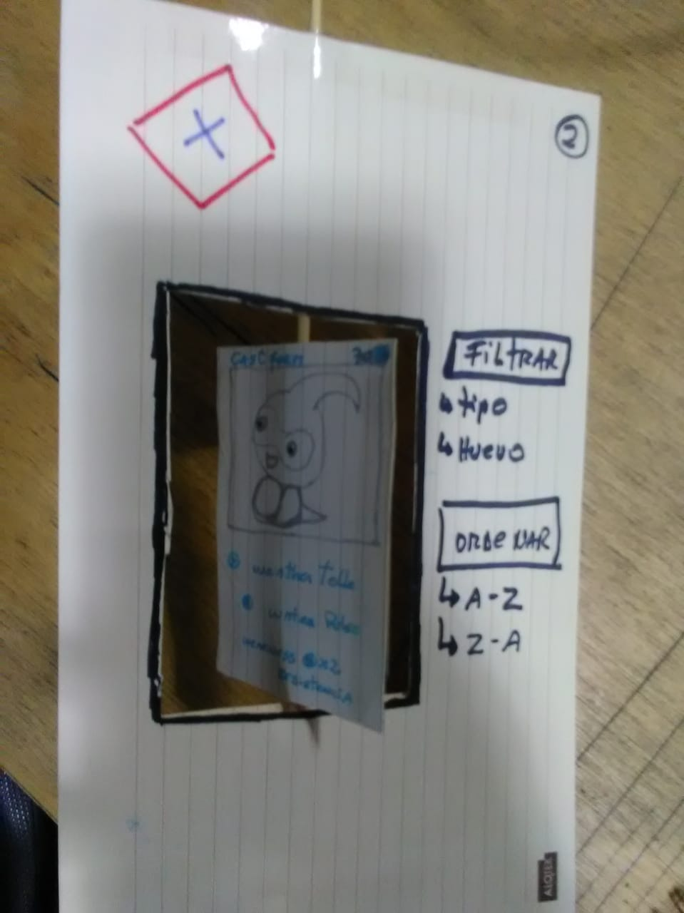
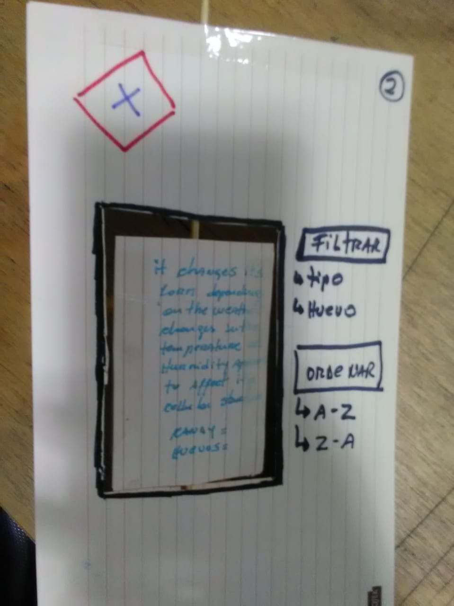

# Data Lovers

## Preámbulo

Pokémon GO es un videojuego de realidad aumentada basado en la localización desarrollado por Niantic, Inc.1​2​ para dispositivos iOS y Android. Es un videojuego gratuito pero contiene microtransacciones.3​ El juego consiste en buscar y capturar personajes de la saga Pokémon escondidos en ubicaciones del mundo real y luchar con ellos, lo que implica desplazarse físicamente por las calles de la ciudad para progresar. La aplicación comporta un elemento de interacción social, ya que promueve reuniones físicas de los usuarios en distintas ubicaciones de sus poblaciones.
El videojuego requiere que el jugador recorra las calles de su ciudad para descubrir toda clase de Pokémon, cuyas distintas especies aparecen dependiendo de la zona visitada. Las calles del mundo real aparecen representadas en Pokémon GO en forma de mapa, que muestra el lugar donde se encuentra el jugador. Además, los mapas de Pokémon GO integran diferentes Pokeparadas (Pokéstops) que permiten conocer museos, instalaciones artísticas, monumentos y lugares históricos, entre otros.4​

Utiliza la realidad aumentada y de acuerdo con el concepto original, los entrenadores podrán capturar Pokémon hasta completar una colección. Otro objetivo es adiestrarlos para que ganen batallas frente a otros. Haciendo uso del GPS del teléfono, la app le avisará con una vibración y una luz intermitente cuando el usuario se encuentre cerca de un Pokémon.5​ También hace uso de monedas llamadas pokemonedas, las cuales pueden ser intercambiadas por elementos cosméticos y de utilidad.6​

Cuando el jugador o entrenador Pokémon enciende la cámara de su teléfono, se puede encontrar con una imagen virtual de un Pokémon, superpuesta sobre la escena real tras la lente. Para capturar las criaturas, se utilizan pokebolas. Esta es una de las características por la que se considera que el juego se basa en la realidad aumentada, ya que permite ver la realidad mezclada con elementos de ficción a través de un teléfono inteligente.5​

Por lo general, los gimnasios de pokémon se encuentran en lugares accesibles para los jugadores de Pokémon GO.
Caramelos y polvo estelar
Los caramelos sirven para evolucionar los pokémon en el juego. Es otra faceta importante y funcionan de la siguiente manera: cuando se atrapa un pokémon, nos da tres caramelos (de ese pokémon específico), 5 si se trata de la siguiente evolución o diez si se encuentra en su máximo estadio evolutivo. También se pueden obtener caramelos en los huevos de pokémon, cuando un pokémon se transfiere o teniendo un compañero pokémon con el que se camina una cierta distancia.7​

Junto con el polvo estelar, los caramelos permiten al jugador subir de nivel a un pokémon.8​ Se necesitan muchos caramelos para evolucionar a cada Pokémon a su siguiente estado.9​

El polvo estelar sirve para subir de nivel (PC) de un pokémon; las maneras de conseguirlo son varias, ya sea capturando pokémon, dándoles bayas en gimnasios, ganando incursiones, completando ciertas investigaciones de campo o eclosionando huevos.10​11​

Gimnasios
En sus primeras versiones, los gimnasios permitían colocar a un mismo pokémon varias veces (1 por persona) hasta un máximo de 10 (nivel alcanzando mediante el entrenamiento en los gimnasios), por lo que no era raro ver 10 snorlax o blissey defendiendo uno indefinidamente.

Debido a la gran defensa y vida de esos pokémon, y que existían gimnasios que eran literalmente imbatibles, se cambio el sistema totalmente.

Ahora en cada gimnasio solo puede haber 1 pokémon de cada tipo (si alguien pone a Snorlax el resto del mismo equipo ya no pueden) para dar más variedad a estos, también se cambio el máximo de pokémon a 6 (no es aumentable como anteriormente), además de tener un medidor de motivación basado es sus PC (Puntos de combate)

Cuando colocamos un pokémon en un gimnasio, aparecerá con el 95% de sus PC, que podremos aumentar al 100% dándole una baya. Cuando vaya pasando el tiempo su motivación irá bajando (a más PC más rápido descenderá, para dar oportunidad a jugadores de menor nivel de derrotar a ese pokémon), también perderá motivación si le derrotan en un combate. Por lo que cuando el medidor de motivación llega a rojo, el próximo combate que pierda le hará regresar a su dueño (o si llega a 0 sin ser atacado). Para mantener más tiempo a nuestro Pokémon en el gimnasio, deberemos alimentarle con bayas, pero cuidado, una sola persona no podrá mantener a su pokémon, ya que según lo alimentemos, el efecto de recuperación disminuirá en un 50%, hasta el punto de que las bayas solo subirán 1PC cada una. Para ello necesitaremos que alguien de nuestro equipo lo alimente (pues ese "debuff" de alimentación es individual).

## Resumen del proyecto

Learnig Go, este proyecto fue creado para la ayudar a jugadores inexpertos principiantes que quieren conocer a los 151 pokemones de la ciudad del kanto, experimentando nuevas jugadas y dandoles a conocer todo el mundo de Pokemon, para que tengan una experiencia en tiempo real ademas nos enfocamos en tres jugadores especificos.

### Historias de usuario

Pedro:Adulto mayor, jugador inexperto y curioso que,al ver a su nieto jugar, quiere acompañarlo en la aventura de pokemon, conocer los pokemones segun sus tipos, obtener sus huevos segun los kilometros recorridos y sus candys para la evolucion.
Juan:Jugador de regreso al juego, ya que despues de un tiempo, retirado del mundo pokemon,quiere conocer las actuaslizaciones existentes,sus nuevos pokemones de la ciudad del kanto y conocer todas las innovaciones que cuenta el juego(candys,huevos,evoluciones).
Andres:Jugador inexperto y principiante, que decea conocer a cada pokemon con sus debilidades,huevos,candys,evoluciones, ademas de conocer cada pokemon de la ciudad del kanto.

### Diseño de la Interfaz de Usuario
link

#### Prototipo de baja fidelidad

#### Prototipo de alta fidelidad
Figma:
https://www.figma.com/file/LWc2X7Fc5B3mUb3w4ZrbIUqZ/Untitled?node-id=5%3A2   

#### Testeos de usabilidad
test de usabilidad
link video
https://www.youtube.com/watch?v=EFQUKr6JaUU&feature=youtu.be

#### Prueba nuestra aplicacion en:
https://vurles.github.io/SCL008-data-lovers/src/index.html

### Pruebas unitarias
Filtrar
Ordenar
Calcular

## Consideraciones técnicas

La lógica del proyecto esta implementada completamente en JavaScript
(ES6), HTML y CSS. 

### Herramientas

* [Git](https://git-scm.com/)
* [GitHub](https://github.com/)
* [GitHub Pages](https://pages.github.com/)
* [bootstrap](https://getbootstrap.com/)

